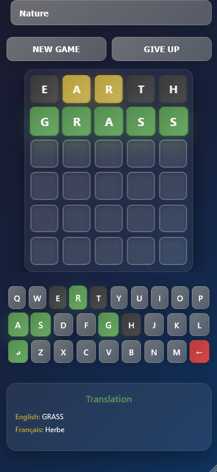
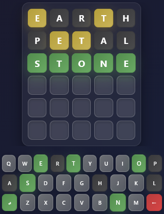

# WordlePractice

## 📸 Screenshot

| Game Interface | Mobile View | Mobile View2 |
|---------------|-------------|-------------|
|  |  |

A modern, mobile-friendly Wordle game with French translations and beautiful UI design.

## 🎮 Features

### Core Gameplay
- **Classic Wordle Mechanics**: Guess the 5-letter word in 6 attempts
- **Color-Coded Feedback**: 
  - 🟩 Green = Correct letter in correct position
  - 🟨 Yellow = Correct letter in wrong position  
  - ⬜ Gray = Letter not in word
- **Smart Keyboard**: Visual feedback showing letter states

### Learning Features
- **French Translations**: Real-time translations using CDN API
- **Word Categories**: Learn vocabulary by topic:
  - 🐾 Animals
  - 🍎 Food
  - 🌿 Nature
  - 🏠 Daily Life
  - 😊 Emotions
  - 👤 Body Parts
  - 🎨 Colors
  - ✈️ Travel

### Modern UI/UX
- **Responsive Design**: Optimized for mobile and desktop
- **Beautiful Gradients**: Modern glassmorphism design
- **Icon-Based Controls**: Intuitive ↵ (Enter) and ← (Delete) buttons
- **Smooth Animations**: Polished transitions and hover effects

## 🚀 Quick Start

### Play Online
Open `index.html` in your browser to start playing immediately.

### Local Development
```bash
# Clone the repository
git clone https://github.com/touilfarouk/aword.git

# Navigate to the project
cd aword/dist

# Open in browser
open index.html
```

## 📱 Mobile Optimization

- **Touch-Friendly**: Optimized for mobile interactions
- **Native App Feel**: Status bar support and safe areas
- **Responsive Layout**: Adapts to all screen sizes
- **Performance**: Smooth 60fps animations

## 🎯 How to Play

1. **Choose a Category**: Select from 8 different word categories
2. **Make Your Guess**: Type a 5-letter word using the keyboard
3. **Get Feedback**: Check the color-coded tiles
4. **Learn Translation**: See the French translation when you win or give up
5. **Try Again**: Start a new game with the "NEW GAME" button

## 🌐 Translation System

The game features an intelligent translation system:

- **CDN-Based**: Uses MyMemory Translation API
- **Caching**: Stores translations for better performance
- **Fallback System**: Local fallbacks for common words
- **Loading States**: Shows loading indicators during translation
- **Error Handling**: Graceful degradation if API fails

## 🎨 Design Features

### Visual Elements
- **Glassmorphism**: Modern frosted glass effects
- **Gradient Backgrounds**: Beautiful color transitions
- **Custom Icons**: Unicode symbols for controls
- **Color Psychology**: Green for success, red for deletion

### Responsive Breakpoints
- **Desktop**: Full-featured layout
- **Tablet**: Optimized spacing
- **Mobile**: Touch-optimized interface
- **Small Screens**: Compact mode

## 🛠️ Technologies Used

- **HTML5**: Semantic markup
- **CSS3**: Modern features (Grid, Flexbox, Backdrop-filter)
- **Vanilla JavaScript**: No frameworks required
- **Translation API**: MyMemory CDN service

## 📂 Project Structure

```
dist/
├── index.html          # Main game interface
├── style.css           # Styling and responsive design
├── script.js           # Game logic and translation service
└── README.md           # This file
```

## 🎮 Game Controls

### Keyboard
- **Letter Keys**: Enter letters
- **Enter Key (↵)**: Submit guess
- **Delete Key (←)**: Remove last letter
- **Physical Keyboard**: Full keyboard support

### Touch/Mouse
- **On-screen Keyboard**: Tap letters to input
- **Touch Gestures**: Optimized for mobile
- **Hover Effects**: Visual feedback on desktop

## 🏆 Game Features

### Word Management
- **200+ Words**: Extensive vocabulary across categories
- **5-Letter Filter**: All words are exactly 5 letters
- **Validation**: Ensures only valid words are accepted

### User Experience
- **No Ads**: Clean, distraction-free gaming
- **Instant Feedback**: Immediate response to actions
- **Progress Tracking**: Visual indication of remaining guesses
- **Helpful Messages**: Clear instructions and feedback

## 🌟 Special Features

### Translation Service
- **Real-Time API**: Live translation fetching
- **Smart Caching**: Reduces API calls
- **Multiple Languages**: Easily extensible to other languages
- **Fallback Dictionary**: Offline capability for common words

### Performance Optimizations
- **Lazy Loading**: Efficient resource management
- **Smooth Animations**: Hardware-accelerated CSS
- **Minimal Dependencies**: Fast loading times
- **Efficient Algorithms**: Optimized game logic

## 📈 Browser Support

- **Chrome**: Full support
- **Firefox**: Full support  
- **Safari**: Full support
- **Edge**: Full support
- **Mobile Browsers**: iOS Safari, Chrome Mobile

## 🤝 Contributing

Feel free to contribute to the project:

1. Fork the repository
2. Create a feature branch
3. Make your changes
4. Test thoroughly
5. Submit a pull request

## 📄 License

This project is open source and available under the [MIT License](LICENSE).

## 🎯 Future Enhancements

- [ ] More language translations
- [ ] Word difficulty levels
- [ ] Statistics tracking
- [ ] Dark/light theme toggle
- [ ] Sound effects
- [ ] Haptic feedback
- [ ] Word hints system
- [ ] Multiplayer mode

---

**Enjoy learning English and French with WordlePractice! 🎮📚**
